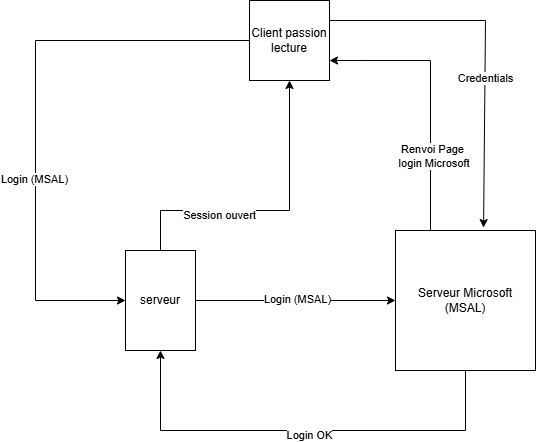

# Rapport : P_CLOUD

**Auteurs :** Romain Denis, Romain Schertenlieb

---

## 1. Introduction

Ce projet a été réalisé dans le cadre du module 346 dédié au Cloud. Son objectif était de migrer une application web vers Azure, d’y intégrer une authentification MSAL, de mettre en place un pipeline de déploiement automatique et de créer une fonction serverless afin de mieux exploiter les services cloud.

---

## 2. Problèmes rencontrés

### 2.1 Connexion à la DB
On a rencontré un problème de connexion à la base de données quand on a lancé l'application sur la machine virtuelle sur Azure.
La cause du problème était que nous n'avions pas mis la machine virtuelle dans le sous réseau du serveur de la base de données.
Donc nous avons du recréer la machine virtuelle et l'ajouter dans le bon sous-réseau. 

### 2.2 Travail en equipe
La nature de ce projet rend compliqué de travailler en parrallel sur plusieures choses differentes. Nous avons essayé mais avec tout les parametres possibles a changer, et les long deploiements, nous avons eu plus de success une fois que nous nous sont mis a travailler en peer programming

### 2.3 Plan Azure
Nous avions eu une erreure pour se connecter au sous-reseau du server de base de donnes. Le plan que nous avions pris pour notre app service ne permettait pas de changer. Nous avons donc du recreer l'app service avec le bon plan.

### 2.4 Redirection MSAL
Lorsque nous avons implementé MSAL, nous avons eu des problemes de MSAL qui redirigait vers le mauvais URL, et donc retournait une erreure. Le probleme etait que l'url etait https et pas http.

## 3. Connaissances acquises

Dans ce projet, nous avons acquis un grand nombre de compétences, voici les principales que nous avons développées :

* **Gestion de l'infrastructure Cloud (Azure) :** Nous avons appris à configurer des services Azure (VM, MySQL Flexible Server, Azure Functions). Nous avons également compris l'importance de la configuration réseau (VNet et sous-réseaux) afin de garantir une communication sécurisée entre les ressources, et que cette étape doit être réalisée en amont de la création des composants Cloud.

* **Automatisation CI/CD :** La mise en place de GitHub Actions nous a permis d’approfondir notre compréhension du CI/CD. L’automatisation du build à chaque modification du code a considérablement réduit les erreurs manuelles et accéléré les étapes les plus répétitives.

* **Authentification (MSAL) :** L’intégration de Microsoft Entra ID nous a permis de découvrir une approche d’authentification à la fois sécurisée et standardisée. Nous avons appris à gérer les secrets applicatifs via des variables d’environnement (.env), à configurer les Redirect URIs et à comprendre les interactions entre Crypto et MSAL.

* **Résolution de problèmes (Troubleshooting) :** Ce projet nous a amenés à exploiter différents outils de logs (Docker logs, journaux Azure) afin d’analyser des erreurs absentes en environnement local. Cela nous a permis de gagner en autonomie et de nous familiariser davantage avec l’ensemble de ces technologies.

## 4. Répartition des tâches

Pour ce projet, nous avons essayé de répartir au mieux les tâches entre nous. Lorsque nous avons eu des problèmes, nous avons fait beaucoup de peer programming. 

### 4.1 Romain Denis
- Creation de pipeline CICD
- Creation de lien Azure/GitHub
- Debuggage
- Deploiements
- Presentation
- Rapport

### 4.2 Romain Schertenlieb
- Import de codebase de base
- Lecture de documentation
- configuration AZURE 
- identiter managée
- MSAL
- debut de la fonction
- Presentation
- Debuggage

## 5. MSAL

MSAL (Microsoft Authentication Library) permet d’implémenter une authentification sécurisée via Microsoft Entra ID. L’utilisateur est redirigé vers la page de connexion Microsoft, et une fois authentifié, l’application reçoit des jetons d’accès lui permettant de vérifier l’identité de l’utilisateur et de sécuriser l’accès aux ressources sans gérer directement les identifiants.

## 6. Fichier .env
Pour ce projet, les variables d’environnement sont gérées via un fichier .env généré automatiquement par la pipeline CI à partir des secrets stockés dans GitHub et Azure. Cette approche permet de sécuriser les informations sensibles et de simplifier le déploiement entre l’environnement de développement local et l’infrastructure de production sur Azure.

Voici le détail des variables utilisées :

* **DATABASE_URL** : Chaîne de connexion à la base de données MySQL. Elle inclut les identifiants, l’adresse de l’hôte, le port (6033) ainsi que le nom de la base de données (db_passionlecture).

* **DATABASE_NAME** : Nom de la base de données.

* **AZURE_AD_CLIENT_ID** : Identifiant unique de l’application, généré lors de son enregistrement sur le portail Azure Entra ID (fourni par l’enseignant).

* **AZURE_AD_CLIENT_SECRET** : Clé secrète (mot de passe) permettant à l’application de s’authentifier auprès des services d’identité Microsoft (fournie par l’enseignant).

* **AZURE_AD_TENANT_ID** : Identifiant de l’annuaire Azure (le Tenant) auquel l’application est rattachée, permettant de restreindre l’accès aux comptes de l’organisation. Dans notre cas, il s’agit du Tenant ID de l’État de Vaud (fourni par l’enseignant).

## Schéma 